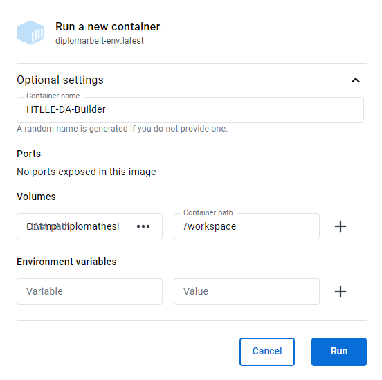

# Docker container

The provided `Dockerfile` can be used to create a dockerized build environment where all depenencies are satisfied.

## Image

The Docker image is per default configured for the timezone of ***Europe/Vienna*** and has all the packages installed for the compilation, spellchecking and source management of the diploma thesis. The user under which the container is operated is named ***builder*** and the default working directory is ***/workspace*** which is also specified as a dedicated ***mounted volume***.

## Building the image

In order to build a Docker image just run the following command on a Docker host (Tested with Docker 27.2.0).

```sh
docker build -t htlle-da-builder .
```

This creates an image that contains all dependencies and expects to find your diploma thesis mounted into the `/workspace` folder.

Alternatively, the image can be pulled from the [Docker Hub](https://hub.docker.com/r/bytebang/htlle-da-builder).

## Usage

### Targets

One cannot just build the diploma thesis with the Docker image (***pdf***), but also use [**environment variables**](#environment-variables) or [**command line arguments**](#command-line-arguments) to make a spellcheck over your files (***spellcheck***), print out the compiled raw LaTeX file for debugging (***tex***) or manually delete the staging (***clean-stage***), output (***clean-out***) or both (***clean-all***) directories if something went wrong and they were not deleted automatically.

The accepted inputs / build targets, with default set to **pdf**, are:

- pdf
- spellcheck
- tex
- clean-stage
- clean-out
- clean-all

### Environment variables

The container provides a set of environment variables which can be used to manipulate the build process. Any interaction, script, or CLI flag automatically sets the corresponding environment variable in the background.

- **TARGETS**
  - One or a comma seperated list of targets which are to be executed.
  - Targets are executed in the same order they are given.
  - Avaible targets are the same and named as [specified](#targets).
  - Defaults to: **pdf**
- **TEMPLATE**
  - Sets the name of the folder in which the template files reside.
  - Defaults to: **da-base-template**
- **SOURCE_DIR**
  - Sets the directory in which the diploma thesis and therefore the files used to build it lie.
  - Defaults to: **/workspace**
- **OUTPUT_DIR**
  - Sets the directory into which the files produced by the selected target are placed.
  - Defaults to: **SOURCE_DIR/out**
- **STAGING_DIR**
  - Sets the directory into which the temporary files required to build the selected target are placed.
  - Defaults to: **staging**

### Command Line Arguments

When starting the Docker container from the command line, the environment variables can also be specified as positional command line arguments. The arguments are mapped to environment variables in the following order:

1. TARGETS
2. TEMPLATE
3. SOURCE_DIR
4. OUTPUT_DIR
5. STAGING_DIR

### Host CLI

One can build the diploma thesis PDF by running one of the following commands:

```sh
docker run -it --rm -v $(pwd):/workspace htlle-da-builder
```

or

```sh
docker run -it --rm -v $(pwd):/workspace htlle-da-builder pdf
```

or

```sh
docker run -it --rm -v $(pwd):/workspace -e TARGETS=pdf htlle-da-builder
```

or

```sh
docker run -it --rm -v $(pwd):/workspace htlle-da-builder --targets=pdf
```

These command run the *htlle-da-builder* Docker container interactively, mount the current directory into the container at `/workspace` and automatically cleans the container up after it exits. Errors and log messages are shown in the console. The output files will be written back to the folder specified in the `OUTPUT_DIR` environment variable.

When using environment variables the syntax which is used to set them inside of the Docker container is `-e VARIABLE=VALUE`. Following is an example specifying everything manually.

```sh
docker run -it --rm \
  -v $(pwd):/workspace \
  -e TARGETS=pdf \
  -e TEMPLATE=da-base-template \
  -e SOURCE_DIR=/workspace \
  -e OUTPUT_DIR=/workspace/out \
  -e STAGING_DIR=staging \
  htll-da-builder
```

When using command line arguments the parameters are appended at the end of the command. They can either be presented as raw arguments or in a cleaner flag version. Following is an example specifying everything manually with raw arguments.

```sh
docker run -it --rm \
  -v $(pwd):/workspace \
  htll-da-builder \
  pdf \
  da-base-template \
  /workspace \
  /workspace/out \
  staging
```

Following is an example specifying everything manually with flag arguments.

```sh
docker run -it --rm \
  -v $(pwd):/workspace \
  htll-da-builder \
  --targets=pdf \
  --tmpl=da-base-template \
  --src-dir=/workspace \
  --out-dir=/workspace/out \
  --stage-dir=staging
```

### Container CLI

Inside the Docker container one has several options to start a build process with one or multiple of the [supported targets](#targets).

The first option is provided in form of a command named after the target which is to be executed. The execution assumes default conditions which cannot be changed in the process.

The second option is the `build` command. By just typing *build* the *pdf* target under default conditions gets executed. But it supports a lot more.

- `build <targets> <template> <source_dir> <output_dir> <staging_dir>`
- `build --targets=<targets> --tmpl=<template> --src-dir=<source_dir> --out-dir=<output_dir> --stage-dir=<staging_dir>`

Following is an example specifying everything manually with raw arguments.

```sh
build pdf da-base-template /workspace /workspace/out staging
```

Following is an example specifying everything manually and also executing every possible target with flag arguments.

```sh
build --targets=pdf --tmpl=da-base-template --src-dir=/workspace --out-dir=/workspace/out --stage-dir=staging
```

### Docker Desktop

The Docker image can be used like in the command line also with *Docker Desktop*. In Docker Desktop under Volumes the hosts path to the folder with the to be build diploma thesis is on the left site (**Variable**) and on the right site (**Value**) the name of the folder inside of the container (**/workspace**). The same principle is to be applied for other [environment variables](#environment-variables).



### Devcontainer & VS Code

The provided [Devcontainer](https://containers.dev/) can be used to setup a fully integrated Visual Studio Code Docker container with all necessary extensions *(spellcheckers, linters, ...)* and configurations already present for writing the diploma thesis.

**Authors:** [Marko Schrempf](https://github.com/bitsneak), Günther Hutter
