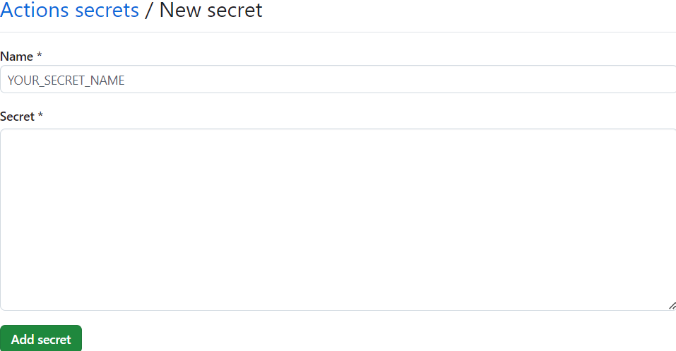

# GitHub action

The workflow `Build and send diploma thesis` allows the user to build the diploma thesis via a GitHub workflow and send it to a Microsoft Teams channel.

## GitHub repository

Create a folder `.github/workflows` in the root of your repository. You can now choose between `diploma-thesis-docker.yml`, `diploma-thesis-manual.yml` and `diploma-thesis-action.yml` to paste into the newly created folder. It is recommended to rename the the chosen GitHub Action variant to `thesis.yml`.

- **-manual**
  - installs all the dependencies in the Action itself
  - runtime: ~10 minutes
  - recommended for diploma theses <= 2024
- **-docker**
  - uses the Docker image
  - runtime: ~3 minutes
- **-action**
  - uses the published GitHub Action provided by the `HTLLE-DA-Vorlage` repository
  - runtime: ~3 minutes

## GitHub secrets

In your GitHub repository you first need to create the secrets the Action needs. For that, go to the `Settings` Tab of your repository and under the section `Security` go to `Secrets and variables` and choose to the option `Actions`.

Now click on the button `New repository secret` to create the GitHub Action secrets.

Here you enter the names of the secrets and their values corresponding to the following table. After inserting the contents of the new secret click `Add secret`.

| Name | Secret |
|-|-|
| MAIL | Your email address from which the diploma thesis should be sent from  |
| MAIL_PASSWORD | The password for MAIL |
| SMTP_PORT | The SMTP port corresponding to SMTP_SERVER |
| SMTP_SERVER | The SMTP Server for your email address |
| TEAMS_MAIL | The Teams channel email from the channel the diploma thesis should be sent to |

Now it should look like this:

## Microsoft Teams

1. Create a new channel in your Team named `build`.
2. Go to the channel settings of `build` and go to `Get email address`.

3. Copy the email address which is inside of the sharp brackets.

## Notes

- Sending the diploma thesis and thus automated emails using a school email address is not supported. Therefore use an email address that does not correspond to your school email address.
- If you use Gmail as a sending email address, you have to generate an app password and use this instead of your normal password. [Manual](https://knowledge.workspace.google.com/kb/how-to-create-app-passwords-000009237)
